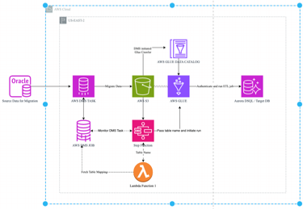
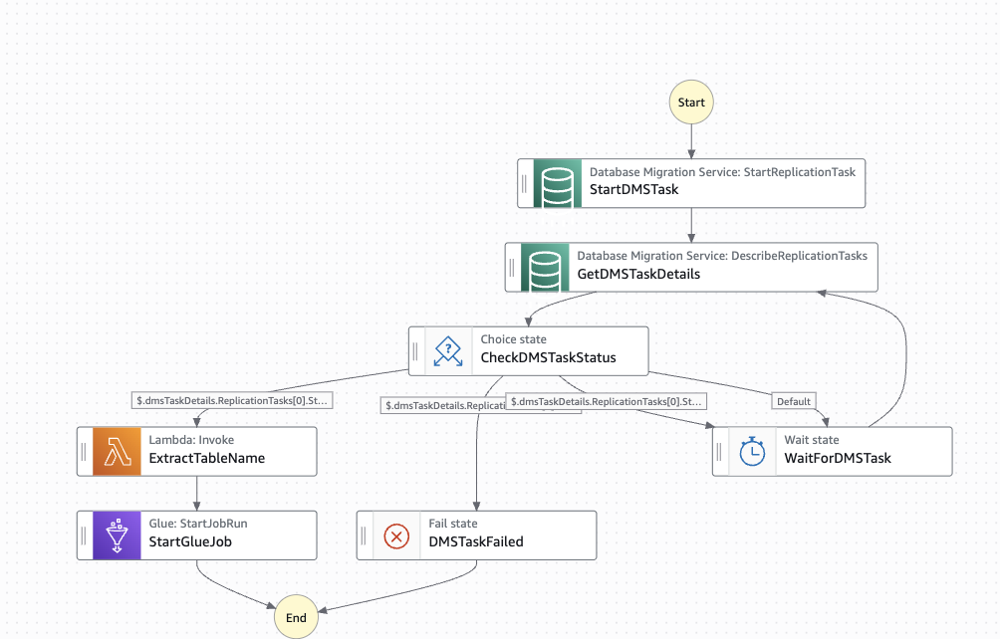

# Migrate from Oracle to Amazon Aurora DSQL using AWS DMS

This repository contains the code and configuration for migrating an Oracle database to Amazon Aurora DSQL using an automated pipeline built with AWS DMS, AWS Step Functions, AWS Lambda, and AWS Glue.

## Architecture

The following diagram illustrates the solution architecture:



**Step Functions Orchestration Workflow:**



## Repository Structure

```
.
|-- README.md
|-- images/
|   |-- architecture.png              # High-level solution architecture
|   |-- step-functions-workflow.png    # Step Functions orchestrator diagram
|-- lambda/
|   |-- index.mjs                     # Lambda: extract table names from DMS mappings
|-- glue/
|   |-- oracle_to_dsql_etl.py         # Glue ETL: schema creation and data loading
|-- step-functions/
|   |-- state-machine.asl.json        # Step Functions state machine definition
|-- iam-policies/
|   |-- glue-job-policy.json                       # IAM policy for Glue job
|   |-- step-functions-execution-role-policy.json   # IAM policy for Step Functions
```

## Components

### 1. AWS DMS Task
Migrates data from Oracle to Amazon S3 in CSV format and automatically creates the AWS Glue Data Catalog.

### 2. Lambda Function (`lambda/index.mjs`)
Extracts table name information from AWS DMS task mappings to pass to the Glue ETL job.

### 3. AWS Glue ETL Job (`glue/oracle_to_dsql_etl.py`)
- Reads schema from the Glue Data Catalog
- Maps Oracle/Glue data types to Aurora DSQL-compatible PostgreSQL types
- Creates target tables in Aurora DSQL
- Reads CSV data from S3 and loads it into Aurora DSQL via JDBC

### 4. Step Functions State Machine (`step-functions/state-machine.asl.json`)
Orchestrates the full workflow:
1. Starts the AWS DMS replication task
2. Polls DMS task status every 60 seconds
3. On completion, invokes Lambda to extract table names
4. Triggers the Glue ETL job with the extracted table name

## Prerequisites

1. A source Oracle database configured as a replication source for AWS DMS
2. An S3 bucket for intermediate data storage
3. An Aurora DSQL cluster (single-Region or multi-Region)
4. IAM permissions for:
   - `iam:CreateServiceLinkedRole`
   - `dsql:*`

## Configuration

Replace the following placeholder values in the code:

| Placeholder | Description |
|---|---|
| `YOUR_CLUSTER_ENDPOINT` | Aurora DSQL cluster endpoint |
| `YOUR_REGION` | AWS Region (e.g., `us-east-1`) |
| `YOUR_CATALOG_DATABASE` | Glue Data Catalog database name |
| `ACCOUNT_ID` | Your AWS account ID |
| `YOUR_DMS_TASK_ID` | AWS DMS replication task ID |
| `YOUR_LAMBDA_FUNCTION_NAME` | Lambda function name |
| `YOUR_GLUE_JOB_NAME` | Glue job name |
| `your-migration-bucket` | S3 bucket for DMS output |

## Deployment Steps

1. **Create Aurora DSQL Cluster** - Via the Aurora DSQL console
2. **Configure AWS DMS** - Create replication instance, source/target endpoints, and migration task
3. **Deploy Lambda Function** - Upload `lambda/index.mjs` with Node.js 18+ runtime
4. **Create Glue ETL Job** - Upload `glue/oracle_to_dsql_etl.py` with:
   - Dependent JAR: `postgresql-42.7.4.jar`
   - Python module: `boto3>=1.35.95`
5. **Create Step Functions State Machine** - Use `step-functions/state-machine.asl.json`
6. **Apply IAM Policies** - Attach policies from `iam-policies/`

## Key Technical Notes

- **Authentication**: Aurora DSQL uses IAM-based auth tokens (max 24hr, set to 1hr in code)
- **Isolation Level**: `REPEATABLE_READ` is required for Aurora DSQL writes
- **Batch Size**: Data is written in batches of 9,900 rows per partition
- **Data Type Mapping**: Custom mapping handles Oracle to Glue to Aurora DSQL type conversions


## Security Considerations

This solution implements the following security best practices:

- **Input validation**: Table names are validated against a strict regex pattern (`^[a-zA-Z0-9_]{1,64}# Migrate from Oracle to Amazon Aurora DSQL using AWS DMS

This repository contains the code and configuration for migrating an Oracle database to Amazon Aurora DSQL using an automated pipeline built with AWS DMS, AWS Step Functions, AWS Lambda, and AWS Glue.

## Architecture

The following diagram illustrates the solution architecture:


**Step Functions Orchestration Workflow:**


## Repository Structure

```
.
|-- README.md
|-- images/
|   |-- architecture.png              # High-level solution architecture
|   |-- step-functions-workflow.png    # Step Functions orchestrator diagram
|-- lambda/
|   |-- index.mjs                     # Lambda: extract table names from DMS mappings
|-- glue/
|   |-- oracle_to_dsql_etl.py         # Glue ETL: schema creation and data loading
|-- step-functions/
|   |-- state-machine.asl.json        # Step Functions state machine definition
|-- iam-policies/
|   |-- glue-job-policy.json                       # IAM policy for Glue job
|   |-- step-functions-execution-role-policy.json   # IAM policy for Step Functions
```

## Components

### 1. AWS DMS Task
Migrates data from Oracle to Amazon S3 in CSV format and automatically creates the AWS Glue Data Catalog.

### 2. Lambda Function (`lambda/index.mjs`)
Extracts table name information from AWS DMS task mappings to pass to the Glue ETL job.

### 3. AWS Glue ETL Job (`glue/oracle_to_dsql_etl.py`)
- Reads schema from the Glue Data Catalog
- Maps Oracle/Glue data types to Aurora DSQL-compatible PostgreSQL types
- Creates target tables in Aurora DSQL
- Reads CSV data from S3 and loads it into Aurora DSQL via JDBC

### 4. Step Functions State Machine (`step-functions/state-machine.asl.json`)
Orchestrates the full workflow:
1. Starts the AWS DMS replication task
2. Polls DMS task status every 60 seconds
3. On completion, invokes Lambda to extract table names
4. Triggers the Glue ETL job with the extracted table name

## Prerequisites

1. A source Oracle database configured as a replication source for AWS DMS
2. An S3 bucket for intermediate data storage
3. An Aurora DSQL cluster (single-Region or multi-Region)
4. IAM permissions for:
   - `iam:CreateServiceLinkedRole`
   - `dsql:*`

## Configuration

Replace the following placeholder values in the code:

| Placeholder | Description |
|---|---|
| `YOUR_CLUSTER_ENDPOINT` | Aurora DSQL cluster endpoint |
| `YOUR_REGION` | AWS Region (e.g., `us-east-1`) |
| `YOUR_CATALOG_DATABASE` | Glue Data Catalog database name |
| `ACCOUNT_ID` | Your AWS account ID |
| `YOUR_DMS_TASK_ID` | AWS DMS replication task ID |
| `YOUR_LAMBDA_FUNCTION_NAME` | Lambda function name |
| `YOUR_GLUE_JOB_NAME` | Glue job name |
| `your-migration-bucket` | S3 bucket for DMS output |

## Deployment Steps

1. **Create Aurora DSQL Cluster** - Via the Aurora DSQL console
2. **Configure AWS DMS** - Create replication instance, source/target endpoints, and migration task
3. **Deploy Lambda Function** - Upload `lambda/index.mjs` with Node.js 18+ runtime
4. **Create Glue ETL Job** - Upload `glue/oracle_to_dsql_etl.py` with:
   - Dependent JAR: `postgresql-42.7.4.jar`
   - Python module: `boto3>=1.35.95`
5. **Create Step Functions State Machine** - Use `step-functions/state-machine.asl.json`
6. **Apply IAM Policies** - Attach policies from `iam-policies/`

## Key Technical Notes

- **Authentication**: Aurora DSQL uses IAM-based auth tokens (max 24hr, set to 1hr in code)
- **Isolation Level**: `REPEATABLE_READ` is required for Aurora DSQL writes
- **Batch Size**: Data is written in batches of 9,900 rows per partition
- **Data Type Mapping**: Custom mapping handles Oracle to Glue to Aurora DSQL type conversions

) to prevent SQL injection
- **IAM least-privilege**: All IAM policies use scoped resource ARNs (no wildcards). Permissions are limited to only the specific actions required
- **S3 bucket security**: Block Public Access enabled, default encryption (SSE-KMS), and a bucket policy enforcing TLS for all data transfers (see `security/s3-bucket-policy.json`)
- **Encryption in transit**: SSL/TLS required for Oracle source endpoint (verify-full), S3 target endpoint (SSE_KMS), and Aurora DSQL connections (sslmode=require)
- **Short-lived authentication tokens**: Aurora DSQL auth tokens expire after 1 hour (ExpiresIn=3600)
- **Secure token handling**: Tokens are never logged, stored only in memory, and generated fresh for each job execution

## References

- [Getting started with Aurora DSQL](https://docs.aws.amazon.com/aurora-dsql/latest/userguide/getting-started.html)
- [AWS DMS Documentation](https://docs.aws.amazon.com/dms/)
- [AWS Glue Developer Guide](https://docs.aws.amazon.com/glue/latest/dg/)
- [AWS Step Functions Developer Guide](https://docs.aws.amazon.com/step-functions/latest/dg/)

## License

This sample code is made available under the MIT-0 license. See the LICENSE file.
